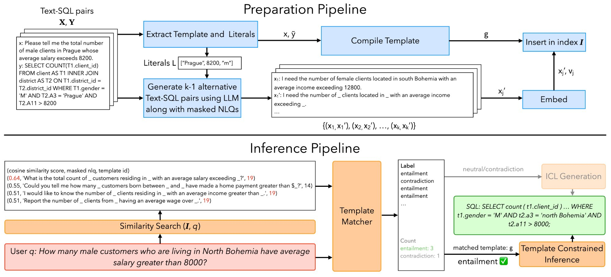
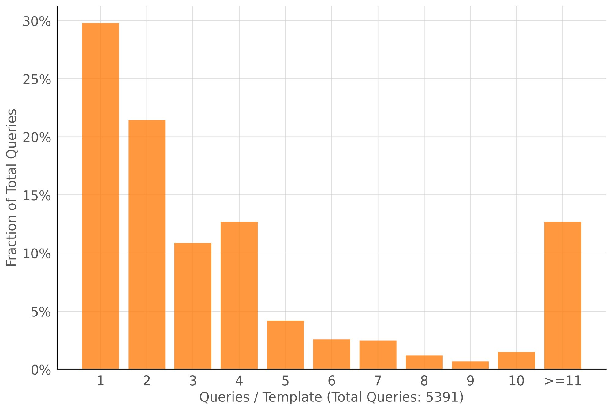

# Architecture

TeCoD is organized as a small service graph behind a Python API and Typer CLI.



## Runtime Flow

```text
Natural-language query
  -> EmbeddingService
  -> VectorStoreService
  -> NLI reranking
  -> Template/example selection
  -> ModelService or OpenAICompatService
  -> GenerationOutput
```

The retrieval distribution used by TeCoD experiments is shown below:



## Main Components

| Component | Path | Role |
| --- | --- | --- |
| Python API | `src/api.py` | High-level `TeCoD` class, context manager, cleanup, status. |
| CLI | `main.py`, `src/cli/commands.py` | Commands for interactive use, data preparation, indexing, template compilation, and status. |
| Config | `src/config/` | Hydra loading and Pydantic validation. |
| Embeddings | `src/services/embedding.py` | Embeds queries and examples. |
| Vector store | `src/services/vector_store.py` | Milvus Lite retrieval. |
| Model factory | `src/services/factory.py` | Selects local or OpenAI-compatible generation service. |
| TeCoD service | `src/services/tecod.py` | Orchestrates retrieval, NLI, method selection, and generation. |
| Templates | `src/services/template.py` | Loads templates and compiled template state. |
| PDEC submodule | `src/pdec/` | Partitioned decoding and SQL template utilities. |

## Service Lifecycle

The API constructor loads configuration, creates services, initializes them, and exposes generation methods. Use the context manager or call `cleanup()` when done:

```python
from src.api import TeCoD

with TeCoD(
    config_overrides=["+data=financial"],
) as tecod:
    result = tecod.generate(
        "What is the count of accounts opting for post-transaction issuance that are located in north Moravia?"
    )
```

## Local vs API Providers

`tecod.provider=local` loads a Hugging Face model in-process and supports direct constrained decoding methods. `tecod.provider=openai` uses the OpenAI-compatible chat completions interface and supports prompt-based methods.

The embedding and NLI services are local in both modes.
